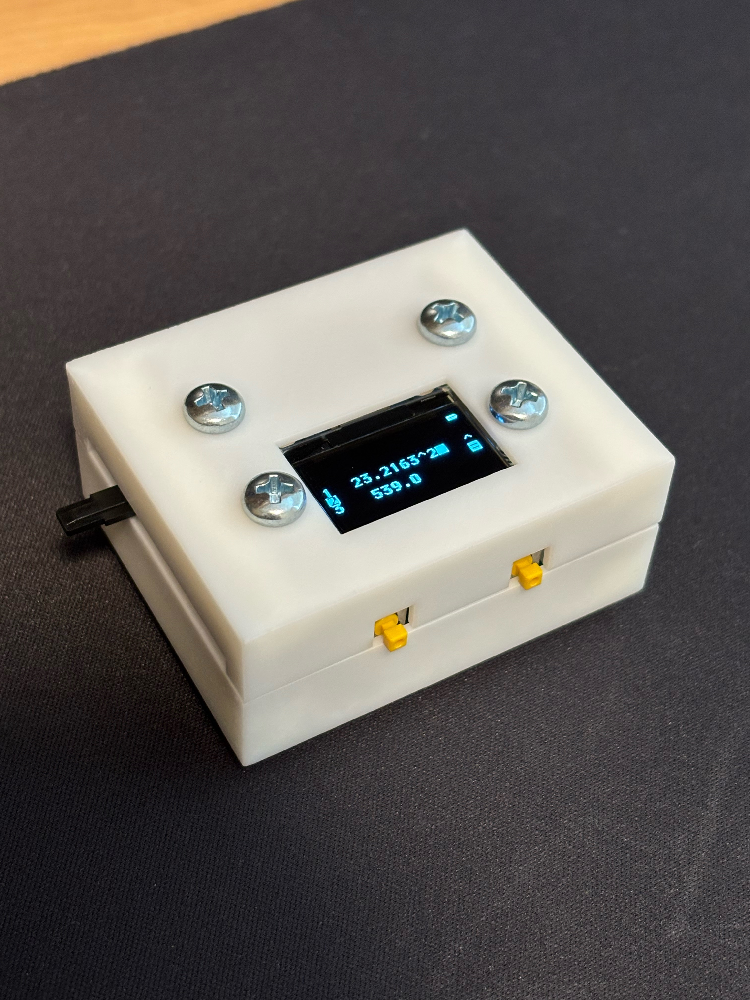

What?
=====
ABACUS is a miniature handheld calculator with a slider-based interface, an OLED display, and an integrated LiPo battery that can be charged over USB-C.

It is based on the STM32C0, with all software written from scratch (except for picolibc, upon which it depends).

**IMPORTANT**: Many of the characters used for the UI are from the font ChronoType by [Caveras](https://caveras.net). See the FONT_LICENSE file for details on usage. Note that usage of the .raw image files containing these characters, or of the corresponding byte arrays in sprites.c, also falls under the terms of this license, as I understand it.

How?
====
The PCB can be ordered from a commercial manufacturer. Parts were chosen mostly to keep costs down with JLCPCB's assembly service.

The enclosure is designed to be easily 3D printed.

The software can be compiled by running `make` in the abacus_fw directory. This requires picolibc, specifically targeting the Cortex M0. Sprite generation is done using [QSPRITELY](https://github.com/henryrov/QSPRITELY), so be sure to clone with submodules or initialize submodules after cloning. The math itself is done by a modified version of [DESCENT](https://github.com/henryrov/DESCENT).

The board can be flashed over SWD using the 3x1 pin socket on the board (top is SWCLK, middle is SWDIO, bottom is ground). For this, I personally used an FT232H breakout board with openocd, set up similarly to how it is [here](https://github.com/m3y54m/cjmcu-ft232hq-programmer). If using the same setup, simply run `make flash` inside the abacus_fw directory. The debug interface is only available for a few seconds after reset, so either press the reset button or flip the power switch immediately before trying to flash.
